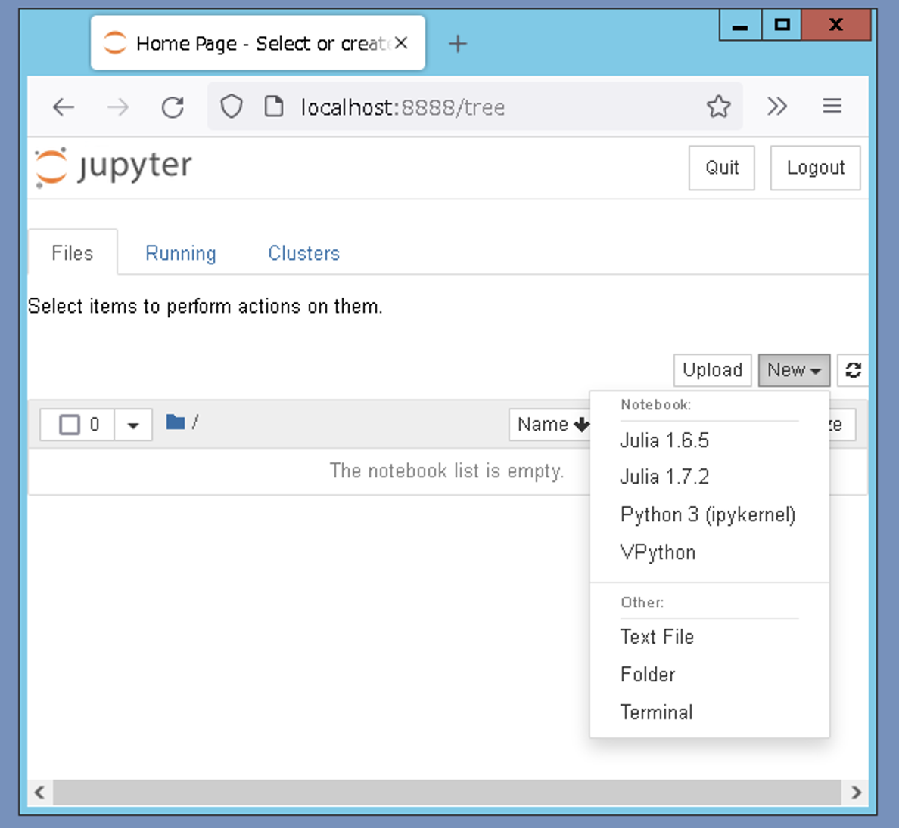

# Juliaの実行環境

## 全学計算機システム

### Juliaの起動
全学計算機システムのWindows端末（あるいは[リモートデスクトップ](https://www.u.tsukuba.ac.jp/remote/)）
で実行する方法について説明する．

Windows端末にログイン後，Windowsメニューから Juliaのアイコンを見つけて起動する．
あるいは，検索窓から `julia`とタイプしてもよい．

起動したら，念のため，`pwd()` (print working directory) コマンドでカレントディレクトリを確認しよう．
```
julia> pwd()
```
ここでユーザーフォルダー `C:¥¥Users¥¥〈ユーザー名〉` と表示されれば問題ないが，
私がリモートデスクトップで試した限りでは， `C:¥¥Users¥¥Administrator` と表示されるので注意が必要である．

フォルダー移動は `cd()` (change director) コマンドで行う．`cd()`は引数無しで実行すると
ユーザーフォルダーに移動する．
```
julia> cd()
```
このあと，カレントディレクトリを再度確認．
```
julia> pwd()
```
`C:¥¥Users¥¥〈ユーザー名〉`が出力されれば大丈夫である．
もちろん，`cd("C:¥¥Users¥〈ユーザー名〉")`とベタ打ちしてもよい．

### REPL(対話モード)でのコマンド実行
プロンプト `julia>` にコマンドを打ち込んで `Enterキー`押下で実行する．
```@repl
println("hello, world")
```

### ソースファイルの読み込み
[`Visual Studio Code`](https://code.visualstudio.com/) などのテキストエディタ
で，次の内容で `hellow.jl` という名前で保存する．
```
println("hello, world from hellow.jl")
```
プログラミングのコマンド（コード）が記述されたファイルをソースファイルという．
juliaでは `include()`を用いてソースファイルを読み込んで実行することができる．
Juliaのターミナルに移動して，
```
julia> include("hellow.jl")
```
を実行すると，`hellow.jl`内に記述されたコードが読み込まれ実行される．
その結果，`hello, world from hellow.jl` と表示されるはずである．

## Jupyter Notebook (本講義では非サポート)

Windowsメニューから `Jupyter Notebook`を起動する．
ブラウザが立ち上がり，カレントフォルダのファイルリストが表示される．
左上側にある `New`のプルダウンメニューから `Julia 1.7.2` を選択する．
そうすると，Juliaカーネルが起動した状態で空の "ノートブック" が表示される．
```@raw html

```

`In [ ]:` の右側に `versioninfo()` と入力して `Shift+Enter`を押下するとコマンドが実行される．
以下のように表示されていれば正常と思われる．
```
Julia Version 1.7.2
Commit bf53498635 (2022-02-06 15:21 UTC)
Platform Info:
  OS: Windows (x86_64-w64-mingw32)
  CPU: Intel(R) Xeon(R) CPU E5-2699 v4 @ 2.20GHz
  WORD_SIZE: 64
  LIBM: libopenlibm
  LLVM: libLLVM-12.0.1 (ORCJIT, haswell)
Environment:
  JULIA_DEPOT_PATH = Z:\.julia-w
```
プログラムと実行結果がひとつのファイルに収まるし，
MarkdownでLaTeXによる数式も記述できるので便利である．
レポート提出用のpdfファイルも，メニュー`File> Download as > HTML (.html)` で変換したhtmlファイルを
印刷でpdfに変換すれば簡単に生成できる．

しかし，現時点では安定した環境であると言い切れないので，本講義ではサポートできない．

